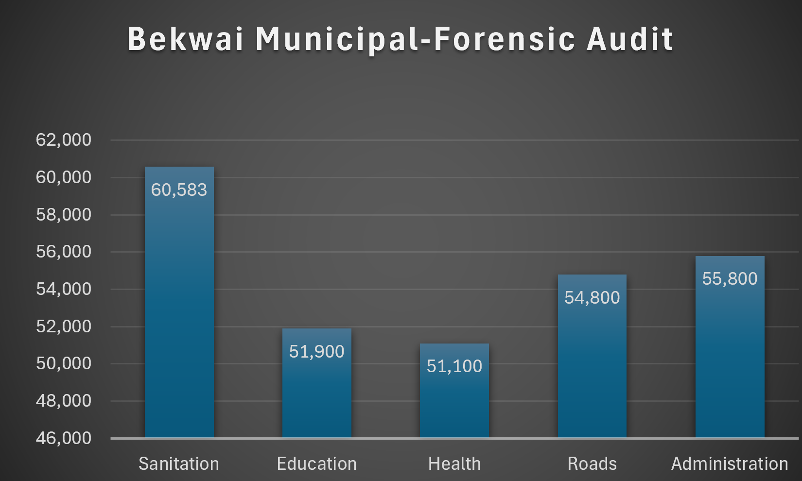

# Bekwai Municipal Forensic Audit - Cybersecurity SOC Dashboard
**Analyst: George Opoku-Mensah | Accounting with Computing (KsTU Ghana Kumasi)/(Cybersecurity) , GH**
## 🚨 Fraud Detected
- Sanitation 85% RISK - Duplicate Invoice GHS 60,583
- Roads 78% RISK - Just-Below-Threshold GHS 55,800
- Administration 42% - Round Number Bias
## 📊 Dashboard
- Pie Chart: Budget by Department Risk
- Bar Chart: Amount vs Approval Threshold (50k)
- Bubble Chart: Anomaly Map Red=Fraud Green=Clean Yellow=Medium
## 🛠️ Techniques
Benford's Law, Duplicate Detection, Just-Below-Threshold, Round-Number Bias, Excel Forensic Dashboard
## 💼 Bank of Ghana SOC Model
This replicates real SOC analyst work to save MMDAs millions.
## Link to Excel & Charts in this repo
## 📸 Evidence - Live Charts

